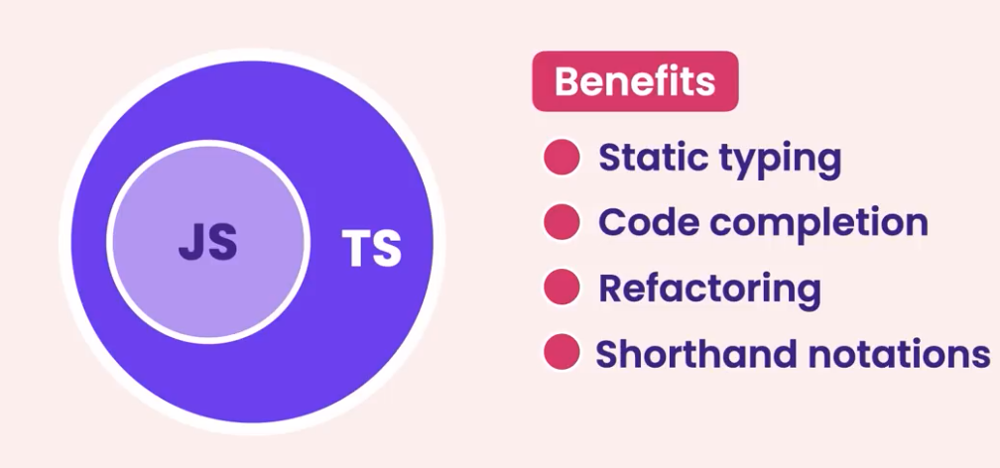

# TypeScript Tutorial

> __Ts is created to address shortcomings of Javascript__




## Compile Time vs Runtime
Compile time: code -> m/c code
two errors occus : semantic (meaning less code) and syntax (wrong structure)

runtime : exec of program (usually after compile time)

## Static Vs Dynamically Typed
### Static 
we know, the type of variables at compile time
e.g. C++, C#, Java


### Dynamic 
the type of variable is decided later at runtime (ofc when program is compiled even with errors ) e.g javascript, python, ruby

## Disadvantages of Typescript
1. we always need a compiler for TS, browsers dont' understand TS yet. ie. Transpilation.


## To Install Typescript

``` sudo npm install Typescript```