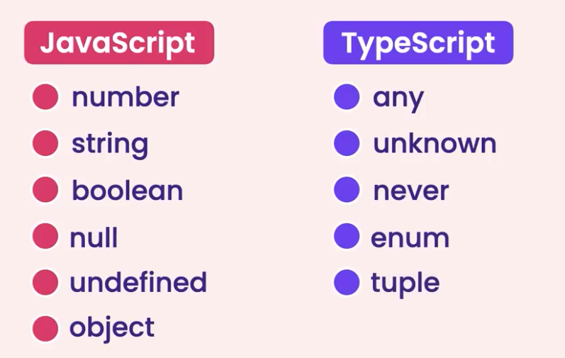

# TypeScript Tutorial

> __Ts is created to address shortcomings of Javascript__


## Compile Time vs Runtime

#### Compile time: code -> m/c code
Two errors occurs : Semantic (meaning less code) and Syntax (wrong structure)

#### Runtime : exec of program (usually after compile time)

## Static Vs Dynamically Typed
### Static 
we know, the type of variables at compile time
e.g. C++, C#, Java


### Dynamic 
the type of variable is decided later at runtime (ofc when program is compiled even with errors ) e.g javascript, python, ruby

## Disadvantages of Typescript
1. we always need a compiler for TS, browsers dont' understand TS yet. ie. Transpilation.


## To Install Typescript

``` sudo npm install Typescript```

## To config Ts File 
```tsc --init```

# In Depth Typescript

### Variables



> if, element is already initialised with type
no need to add _annonations_

```ts
let age:number = 25;
// no need for number
let age = 25;


let name; //currently the type is ANY
name = "Amit";
name = 24;

// no point of using TS then

```
### Arrays

```ts
    let nums = []; // type is any
    num[0] = 1;
    num[1] = "23";

    //  it works for all type
    // but 
    let nums:number = [];
    num[0] = 1;
    num[1] = "23"; // invalid

```

### Tuples
Arrays with just two values
```ts
let user:[number, string] = [1, "Amit"];
// ["Amit", 1] is invalid
```

### Enums
Grouping similar data
```ts
// const a = 1;
// const b = 2;
// const c = 3;

enum Size {a = 12, b, c};
let mySize:Size = Size.b;
console.log(mySize); // 13

// add const before enum for optimized js dist.
```

### Functions 

```ts
 function calculateTax(income:number):number{
    return income +100;
 }

console.log(calculateTax(12));

```

In tsconfig file, 

make ```noUnusedParameter:true``` shows unused Params in funcs, 
also ```noImplicitReturns:true``` make sure funcs return something

####  _Making second param optional in functions_

```ts

 function calculateTax(income:number, year?:number):number{
    if((year||2000) < 2000 )
        return income*10;

    return income*12;
 }

 // not allowed to pass more args
// calculateTax(10_000, 23, 23);

// making 2nd param optional
// by adding year? , ? in front of param 
calculateTax(10_000);


// declare it before hand

 function calculateTax(income:number, year=2022):number{
    if((year)<2000 )
        return income*10;

    return income*12;
 }

// simple , this will override default defintion
calculateTax(10_000, 2023 );
```

### Types 

using Types we can declare, the type 
ex:
```
type Amit = string;
let a:Amit = 34;// illegal 

```

### Objects

```ts

type Employee = {
    readonly id: number, 
    name : string, 
    retire : (date:Date) => void
}

let employee:Employee = {
    id: 2, 
    name: "Amit",
    retire: (date: Date) =>{
        console.log(date)
    }
}

```

### Unions

With Union types, we can assign a variable or func multiple types

 ```ts
 function kgtoLs (weight :number | string ): number{
    if(typeof weight==='number')
        return weight;
    else return parseInt(weight)*1.2;
}

kgtoLs(10);
kgtoLs("10");
kgtoLs(true); // invalid
 
 ```

 ## Dealing Nulls

 ```ts
 // nullable and undefined values

function calcAge(age:number | null ){
   if(age) console.log(age);
   else console.log("helo");
}

calcAge(null);
```

## Optional chaining 

?. -> it is called optional chaining 
used when value could be null or undefined;

```ts
type Customer = {
    birthday: Date
}

function getCustomer(id:number):Customer|null|undefined{ 
    return id === 0 ? null : {birthday: new Date()};
}

let customer = getCustomer(0);

// if(customer!==null && customer!==undefined)
// console.log(customer.birthday);

console.log(customer?.birthday)

// wt if customer is undefined 
```